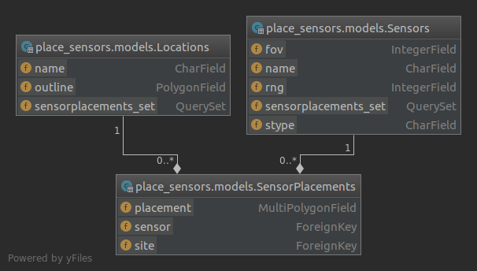

# Site Planner
###Automatic Sensor Deployment tool for Surveillance Systems
##### CSCI E-29 Spring-2019 Final-Project

<!-- START doctoc generated TOC please keep comment here to allow auto update -->
<!-- DON'T EDIT THIS SECTION, INSTEAD RE-RUN doctoc TO UPDATE -->
**Table of Contents**  *generated with [DocToc](https://github.com/thlorenz/doctoc)*

- [Objective](#objective)
- [Pipenv Setup](#pipenv-setup)
- [Docker Setup](#docker-setup)
- [Django App](#django-app)
  - [Database Model](#database-model)
  - [Commands](#commands)
  - [Custom Template](#custom-template)
- [Luigi Task](#luigi-task)
  - [Execution of the Luigi Task](#execution-of-the-luigi-task)

<!-- END doctoc generated TOC please keep comment here to allow auto update -->
## Objective

These days, every establishment, may it be an office complex, 
a museum or a secure facility has a perimeter security system installed. 
Site Planner is an automated sensor deployment for surveillance systems. 
Surveillance systems require deployment of multitude of sensors across perimeters spanning 10's of kilometers. 
Each perimeter has its own unique geometry that would need unique sensor placement decisions.
Sensor could be day camera, thermal or IR camera, Lidar, Radar or one of the many other options available these days.
Each sensor would have its own coverage analysis methods & parameters. 
Visible sensors require Line of Sight calculations, and RF based sensors require Radio Line of Sight calculations.
Site Planner tools allows surveillance system designers to automate the process of 
optimal sensor placement to give gap free coverage using GIS maps and algorithms.


## Pipenv Setup

Key items to install are:
1. Django
2. luigi
3. pset_utils

```yaml

[dev-packages]
pytest = "*"
pytest-cov = "*"
pytest-django = "*"
factory-boy = "*"
pylint = "*"

[packages]
pset_6 = {editable = true,path = "."}
pset-utils = {editable = true,git = "https://github.com/csci-e-29/2019sp-pset-utils-sunilchomal"}
django = "*"
django-environ = "*"
djangorestframework = "*"
django-model-utils = "*"
argon2-cffi = "*"
django-allauth = "*"
django-crispy-forms = "*"
django-extensions = "*"
coreapi = "*"
dask = {extras = ["dataframe"],version = "*"}
fastparquet = "*"
s3fs = "*"
luigi = "*"
django-debug-toolbar = "*"

```

## Docker Setup
Git token to install pset_utils is taken from the environment variable `$CI_USER_TOKEN` and
is used to create a `.netrc` file, which is deleted at the end of the image creation process

```yaml
FROM python:3.7 AS base

ENV \
    PYTHONFAULTHANDLER=1 \
    PYTHONUNBUFFERED=1 \
    PYTHONHASHSEED=random \
    PIP_NO_CACHE_DIR=off \
    PIP_DISABLE_PIP_VERSION_CHECK=on \
    PIP_DEFAULT_TIMEOUT=100 \
    PIPENV_HIDE_EMOJIS=true \
    PIPENV_COLORBLIND=true \
    PIPENV_NOSPIN=true \
    PYTHONPATH="/app:${PYTHONPATH}"

ARG \
    CI_USER_TOKEN

# Set the working directory to /app
WORKDIR /app

# Copy the current directory contents into the container at /app
COPY . /app

RUN echo -e "machine github.com\n  login $CI_USER_TOKEN" >> ~/.netrc

RUN apt-get update
RUN apt-get -qq -y install curl
RUN apt-get -qq -y install binutils libproj-dev gdal-bin
RUN apt-get -qq -y install libsqlite3-mod-spatialite
RUN pip install pipenv

RUN pipenv install

RUN echo -e "machine github.com\n  login " >> ~/.netrc
```

The following command is used to build the docker image

```bash
docker build --build-arg CI_USER_TOKEN=XXX  --tag=place_sensors .
```

To run the docker image, use the following command
```bash
docker run -p 8081:8081 -v HOST_FOLDER:/app/data/ -it \
place_sensors:latest pipenv run python manage.py runserver 0.0.0.0:8081
```


## Django App
A Django app named place_sensors is created. 

### Database Model
Spatialite has been used as the data base. The 



The above illustrates a Star Schema.

```python
class SensorPlacements(models.Model):
    """Stores the sensor placement details"""

    site = models.ForeignKey(Locations, on_delete=models.CASCADE)  # site
    sensor = models.ForeignKey(Sensors, on_delete=models.CASCADE)  # type of sensor
    placement = models.MultiPolygonField()  # sensor placement multipolygons

    class Meta:
        unique_together = ('site', 'sensor', )
    
    def perimeter(self):
        return self.site.outline

    def __str__(self):
        return '{}({})'.format(self.site.name, self.sensor.stype)

```

Note that we have applied the applied unique constraints for site and sensor models.

### Commands

1.  Loading Site data from KML
Django management command for loading site data from a KML file is in 
`place_sensors.management.commands.load_sites.py`

Docker command to execute this is

```bash
docker exec -d pc_docker pipenv run python manage.py load_sites data/sample.kml
```

1.  Running sensor algorithms
Django management command for loading site data from a KML file is in 
`place_sensors.management.commands.run_algos.py`

Docker command to execute this is

```bash
docker exec -d pc_docker pipenv run python manage.py load_sites data/sample.kml
```

2.  Loading Site data from KML
Django management command for calculating the sensor coverage is in 
place_sensors.management.commands.load_sites.py

Docker command to execute this is

```bash
docker exec -d pc_docker pipenv run python manage.py run_algos -r # for Radar
docker exec -d pc_docker pipenv run python manage.py run_algos -c # for Camera
```

3.  Exporting to KML
Django management command for exporting to KML file is in 
`place_sensors.management.commands.load_sites.py`

Docker command to execute this is

```bash
docker exec -d pc_docker pipenv run python manage.py write_kml
```

### Custom Template

To publish data to KML format, a custom Django template 
was created in `place_sensors.templates.site.kml`

```xml
<?xml version="1.0" encoding="UTF-8"?>
<kml xmlns="http://www.opengis.net/kml/2.2">

<Document>

    
    <Placemark>
	<name>{{ site_name }}.{{ sensor_name }}.{{ forloop.counter0 }}</name>
	<Style>
		<LineStyle>
			<color>FF000000</color>
		</LineStyle>
		<PolyStyle>
			<color>7F6891aa</color>
			<fill>1</fill>
			<outline>1</outline>
		</PolyStyle>
	</Style>
	<Polygon>
		<extrude>1</extrude>
		<altitudeMode>clampToGround</altitudeMode>
		<outerBoundaryIs>
			{{ p.exterior_ring.kml|safe }}
		</outerBoundaryIs>
	</Polygon>
    </Placemark>
    

    <Placemark>
	<name>{{ site_name }}</name>
	<Style>
		<LineStyle>
			<color>FF000000</color>
		</LineStyle>
		<PolyStyle>
			<color>7FAAAAAA</color>
			<fill>1</fill>
			<outline>1</outline>
		</PolyStyle>
	</Style>
	<Polygon>
		<extrude>1</extrude>
		<altitudeMode>clampToGround</altitudeMode>
	    <outerBoundaryIs>
    	    {{ outline.exterior_ring.kml|safe }}
		</outerBoundaryIs>
	</Polygon>
    </Placemark>

</Document>

</kml>

```

## Luigi Task

A luigi task for calculating sensor coverage was used

```python
lass PlaceSensorTask(Task):
    """luigi task for calculating sensor placements"""

    INPUT_ROOT = os.path.join('data', 'site_wkt/')
    OUTPUT_ROOT = os.path.join('data', 'sensor_wkt/')
    site = Parameter()  # luigi parameter for site name
    sensor_stype = Parameter()  # luigi parameter for sensor type
    sensor_rng = IntParameter()  # luigi parameter for sensor range
    sensor_fov = IntParameter()  # luigi parameter for sensor fov

    def requires(self):
        return []

    def output(self):
        # return the placement of sensors in Well Known Text (wkt) format
        return LocalTarget(os.path.join(self.OUTPUT_ROOT, "{}_{}".format(self.site, self.sensor_stype)))

    def run(self):
        site_file = os.path.join(self.INPUT_ROOT, self.site)
        with open(site_file, 'r') as f:
            poly_wkt = f.read()

        poly = GEOSGeometry(poly_wkt)
        # convert from lat-long to utm (xy)
        wgsProj = SpatialReference('+proj=longlat +datum=WGS84')
        utmProj = SpatialReference('+proj=utm +zone=18 +ellps=WGS84')

        ct = CoordTransform(wgsProj, utmProj)
        poly.transform(ct)
        # pass the polygon in form of lines in a numpy array
        xy = np.asarray(poly.tuple[0])

        sps = placeSensor(xy, rng=self.sensor_rng, fov=self.sensor_fov, skip_small=True)

        ct = CoordTransform(utmProj, wgsProj)
        sps.transform(ct)
        with self.output().open('w') as f:
            f.write(sps.wkt)
        
```

Exchange of data between the task and Django was in form of files 
containing coverage polygons in form of a "Well Known Text" (wkt) file

The custom code for coverage is in placeSensor, which using GDAL & GEOS libraries from GeoDjango

```bash
GDAL - Geospatial Data Abstraction Library (Django.contrib.gis.gdal)
GEOS - Geometry Engine - Open Source (Django.contrib.gis.geos)
```

### Execution of the Luigi Task

Building of the luigi task list is done by the run_algos command

```python
# create a luigi task list, parameterized by sensors & its specs
# note: as sensor specs are significant parameters, if they are changed,
# the task would run again. this is as per design
task_list = []
for site in Locations.objects.all():
    # TODO: Serialize sensor & site objects and pass them as luigi parameters
    task_list.append(PlaceSensorTask(site.name, s[0].stype, s[0].rng, s[0].fov))

# run the sensor placement tasks
build(task_list, local_scheduler=True)
        
```

## Further Work

* Using elevation information (DTEM)
* Support for Radio Line of Sight for Radars 
* API based interface
* Web interface to give summary information
* Boundary conditions & exceptions checks
* Support for multiple runs for a given user
